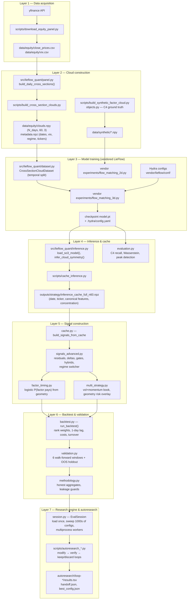

# DESIGN — LieFlow Quant Symmetry Discovery & Trading Platform

This document describes the full system design: every component, how it works, why each design decision was made, and what was optimized at each layer.

---

## 1. What this system is

The repo answers a research question and then tries to monetize the answer:

> Do equity cross-sections in `(momentum, volatility, size)` space exhibit approximate rotational symmetries, and does that geometric structure carry tradable information?

It is built as a **pipeline of decoupled stages**: raw market data → daily point clouds → a trained LieFlow generative model → cached per-day symmetry inference → trading-signal construction → an honest multi-window backtest → an autonomous "autoresearch" optimization layer that sweeps strategy configurations against holdout metrics.

The foundation is [LieFlow](https://github.com/jypark0/lieflow) (Chen et al., *Discovering Symmetry Groups with Flow Matching*, ICML 2026), vendored under `vendor/lieflow/`. LieFlow learns a distribution over a hypothesis Lie group `G` (here SO(2) or SO(3)); the support of the learned distribution reveals the true symmetry subgroup `H ⊆ G` of the data. We repurpose it: instead of point clouds of chairs and arrows, we feed it daily equity cross-sections.

---

## 2. System diagram

Data flows strictly downward. Each stage persists its output to disk, so any downstream stage can be re-run without repeating upstream work — this is the central architectural principle of the whole repo (see §11).

---

## 3. Layer 1 — Data acquisition

**Component:** [scripts/download_equity_panel.py](scripts/download_equity_panel.py)

**What it does.** Downloads daily auto-adjusted close prices for a fixed list of 60 liquid S&P 100 large caps plus `^VIX`, 2015-01-01 → 2024-12-31, via yfinance. Writes two CSVs: `close_prices.csv` (wide, date × ticker) and `vix.csv`.

**Decisions and rationale.**

- **Fixed, hardcoded ticker list of stable large caps.** A survivorship-bias-free point-in-time universe would be ideal but requires paid data (CRSP/Compustat). For a research prototype, a fixed list of *currently and historically* liquid mega-caps is the best free approximation: these names existed and were liquid over the whole 2015–2024 window, so lookahead in universe selection is limited to "these companies stayed large," which is disclosed rather than hidden.
- **Close-only, auto-adjusted.** The strategy trades close-to-close with a 1-day lag, so only adjusted closes are needed. Adjusted prices fold in splits/dividends so momentum and returns are economically correct.
- **CSV rather than a database.** The panel is ~2,500 rows × 61 columns. A flat CSV is trivially inspectable, diffable, and loads in tens of milliseconds — any heavier storage would be complexity with no payoff at this scale.

**Optimizations.** None needed at this layer; it runs once. Downstream loading casts to `float32` ([panel.py:175](src/lieflow_quant/panel.py#L175)) to halve memory.

---

## 4. Layer 2 — Cross-section cloud construction

**Components:** [src/lieflow_quant/panel.py](src/lieflow_quant/panel.py), [scripts/build_cross_section_clouds.py](scripts/build_cross_section_clouds.py), [src/lieflow_quant/objects.py](src/lieflow_quant/objects.py), [scripts/build_synthetic_factor_cloud.py](scripts/build_synthetic_factor_cloud.py)

**What it does.** Converts the price panel into one 3-D point cloud per trading day. For each stock: **20-day log-return momentum**, **20-day annualized realized vol**, and **log price** as a size proxy. Each day's features are cross-sectionally z-scored ([zscore_features](src/lieflow_quant/panel.py#L19)), producing a `(60, 3)` cloud per day, stacked into `clouds.npy` with `metadata.npz` (ISO dates, VIX level, VIX regime label, per-day tickers).

Key functions:

- [build_daily_cross_sections](src/lieflow_quant/panel.py#L86) — vectorized rolling features over the whole panel, then a per-day loop that masks non-finite rows, requires ≥ `min_stocks` (40) valid names, and selects exactly `n_target` names.
- [select_universe_tickers](src/lieflow_quant/panel.py#L27) — when more than `n_target` names are valid, keeps the top-N **by size proxy**, not by column order.
- [assign_expanding_vix_regime](src/lieflow_quant/panel.py#L49) — labels each day low/mid/high VIX using **expanding quantiles computed from strictly prior observations only** (`shift(1)` before `expanding().quantile()`).
- [compute_forward_returns](src/lieflow_quant/panel.py#L258) — close-to-close forward returns, `pct_change(h).shift(-h)`.
- [objects.build_factor_cross_section](src/lieflow_quant/objects.py#L21) — the synthetic ground-truth experiment: a deliberately **asymmetric** L-shaped cluster fan in (momentum, vol), so that C4 symmetry exists only because the data generator imposes it. This gives a known answer to validate the whole method before touching real data.

**Decisions and rationale.**

- **(momentum, vol, size) as the 3 features.** These are the three most canonical cross-sectional equity characteristics, they are cheap to compute from closes alone, and three dimensions is exactly what SO(3) — LieFlow's best-supported continuous group — acts on. Feature choice is thus jointly determined by finance convention and the model's geometry, which is the right coupling: the hypothesis group must act on the feature space.
- **Per-day cross-sectional z-scoring.** Symmetry discovery cares about the *shape* of the cross-section, not its level. Z-scoring removes market-wide drift (e.g., everything's momentum is up) so the model sees geometry, not beta. It also matches how cross-sectional signals are consumed downstream (ranks).
- **Size-ranked universe selection instead of alphabetical.** Earlier versions took the first N columns, which silently biased the universe toward tickers early in the alphabet. Ranking by the size proxy is deterministic, economically meaningful (largest = most liquid), and fixed a real discovered bias — this is called out in the autoresearch handoff notes as one of the found-and-fixed bugs.
- **Expanding (not full-sample) VIX regime quantiles.** Full-sample terciles leak the future: labeling 2016 as "low VIX" using 2020's spike is lookahead. Expanding quantiles over prior observations only make the regime label a legitimate tradeable feature. Days with under 60 days of history get "mid" — a neutral default rather than an unknown that would shrink coverage.
- **Synthetic C4 experiment first.** Before trusting the model on real markets (where the true symmetry is unknown), the pipeline is validated on data with a known planted C4 symmetry and an intentionally asymmetric canonical shape. If the model can't recover a planted symmetry, nothing downstream is meaningful. This is the cheapest possible falsification step and was the correct place to start.
- **Padding disabled by default (`pad_to_target=False`).** An earlier design padded short days by duplicating the last row; duplicated tickers then double-counted in portfolios. Dropping short days (rare with 60 stable mega-caps) is cleaner than papering over them. Where legacy padded data may still appear, downstream deduping defends against it (§8).

**Optimizations.**

- Rolling momentum/vol computed **once, vectorized over the whole panel** as numpy arrays; the per-day loop only slices precomputed rows ([panel.py:107-117](src/lieflow_quant/panel.py#L107-L117)). Building ~2,500 sections takes well under a second.
- Everything stored `float32`; clouds are memory-mapped-friendly `.npy`.
- `metadata.npz` now stores per-day tickers, so [load_cross_sections_from_npy](src/lieflow_quant/panel.py#L190) has a fast path that skips replaying the panel logic entirely; the replay path exists only for older caches without tickers.

---

## 5. Layer 3 — Model training (vendored LieFlow)

**Components:** `vendor/lieflow/` (upstream, MIT), [src/lieflow_quant/dataset.py](src/lieflow_quant/dataset.py), Hydra configs in `vendor/lieflow/conf/` (`SO3_equity_cross_section.yaml`, `C4_factor_cross_section.yaml`, per-regime variants)

**What it does.** Trains a flow-matching model on the group manifold: each training sample is a point cloud; the model learns a distribution over group elements `g ∈ G` such that `g · cloud` looks like a canonical cloud. Training runs through the upstream experiment scripts (`flow_matching_2d.py` for SO(2)/C4 synthetic, `flow_matching_3d.py` for SO(3) equity), configured by Hydra, with checkpoints written to `vendor/lieflow/outputs/<date>/<time>/ckpt/model.pt` alongside the resolved `.hydra/config.yaml`.

`CrossSectionCloudDataset` is our adapter: it loads `clouds.npy`, applies a train/test split, and optionally filters by VIX regime (which powers per-regime symmetry analysis via the `SO3_equity_{low,mid,high}` configs).

**Decisions and rationale.**

- **Vendor the upstream repo instead of reimplementing.** LieFlow's training loop, group parameterizations, and flow-matching math are research code that works. Reimplementing invites subtle geometry bugs. Vendoring (rather than pip-installing a fork) lets us patch in place — e.g., the scipy 1.18 `logm` compatibility fix in `vendor/lieflow/utils.py` — while keeping the diff against upstream inspectable. All our code lives outside the vendor tree and plugs in through the config system, so upstream updates stay mergeable.
- **Integration via Hydra configs + `PYTHONPATH`, zero upstream code edits.** Our dataset class is referenced by dotted path from new YAML files in the vendor's `conf/dataset/`. This is the minimal-invasiveness integration: the vendor experiment scripts don't know our code exists.
- **`split_mode="temporal"` added to the dataset.** The upstream default random split shuffles days across train/test — fine for chairs, fatal for finance, because the model trains on days interleaved with (and after) test days, and any regime memorization leaks. The temporal 80/20 split (train = first 80% of days) makes the model's test window a genuine out-of-sample *future*, and [methodology.ml_temporal_test_start](src/lieflow_quant/methodology.py#L10) reproduces the exact same boundary date downstream so the trading layer can refuse to use inference from the model's own training period. This is one of the most important honesty decisions in the system.
- **Hypothesis group SO(3) for equities, SO(2)→C4 for synthetic.** The synthetic experiment mirrors the paper's C4 arrow experiment (known answer). For real data, SO(3) is the full rotation group of the 3-D feature space — the most permissive hypothesis, imposing nothing; whatever concentration appears in the learned distribution is discovered, not assumed.

**Optimizations.** Training is the slow stage (CPU-bound locally), so the optimization is *around* it, not in it: smoke-test configs with reduced epochs/samples for verification, `WANDB_MODE=disabled` for offline runs, and — critically — the checkpoint is treated as a frozen artifact so training never needs to re-run during strategy research (§6–§9). [inference._checkpoint_n_steps](src/lieflow_quant/inference.py#L16) reads `n_steps` from the checkpoint's own saved Hydra config rather than current YAML defaults, so old checkpoints stay reproducible even if configs drift.

---

## 6. Layer 4 — Symmetry inference and the inference cache

**Components:** [src/lieflow_quant/inference.py](src/lieflow_quant/inference.py), [scripts/cache_inference.py](scripts/cache_inference.py), [src/lieflow_quant/cache.py](src/lieflow_quant/cache.py), [src/lieflow_quant/evaluation.py](src/lieflow_quant/evaluation.py)

**What it does.** [infer_cloud_symmetry](src/lieflow_quant/inference.py#L79) runs the trained model on one day's cloud, `n_mc=16` Monte Carlo draws in a single batched forward pass, and extracts:

- **canonical_momentum / canonical_vol** — per-stock feature values after rotating the cloud into the model's canonical frame ([canonicalize_transform](src/lieflow_quant/inference.py#L71): `(orig^T @ total)^T`, matching the upstream 2-D evaluation convention). Taken as the **median across MC draws** for robustness to sampling noise.
- **radial_distance** — each stock's distance from the canonical cloud's centroid (a "how unusual is this name geometrically" score).
- **z_rotation_angles_deg** — the z-Euler angle of each sampled rotation.
- **concentration** — the max-bin mass of a 36-bin histogram of those angles. High concentration means the model keeps choosing the same rotation → the day's geometry is stable/symmetric; low concentration means the geometry is ambiguous. This single scalar becomes the risk thermostat for every strategy downstream.

`cache_inference.py` runs this for every day and writes one long-form row per (date, ticker) to a compressed `.npz`. [load_inference_cache](src/lieflow_quant/cache.py#L35) reads it back as a DataFrame; [build_signals_from_cache](src/lieflow_quant/cache.py#L48) turns it into a tradeable signal panel.

`evaluation.py` is the science-side consumer of the same inference: [angle_histogram_peaks](src/lieflow_quant/evaluation.py#L12) does circular peak detection on the angle histogram (72 bins, wraparound-padded so peaks at 0°/360° aren't split) and scores **C4 recall** (fraction of the four target angles with a detected peak within 20°), plus a Wasserstein-1 distance to ideal C4 atoms via POT.

**Decisions and rationale.**

- **The inference cache is the load-bearing architectural decision of the whole trading side.** LieFlow inference costs seconds per day on CPU; a 10-year panel is minutes per full pass. Strategy research needs *thousands* of backtests. Decoupling "run the model" (once) from "evaluate a strategy config" (thousands of times) turns each experiment from minutes into milliseconds, and means the entire strategy layer needs no torch, no checkpoint, no GPU. Every autoresearch loop in §10 is only feasible because of this cache.
- **Deterministic seeding per day (`seed + day_idx`).** MC sampling is stochastic; without per-day seeds, two cache builds would disagree and experiments wouldn't be reproducible. Seeding by day index makes the cache a pure function of (checkpoint, data).
- **Median over MC draws, not mean.** The rotation distribution is multi-modal when symmetry is present (that's the point), so a mean would blend modes into a meaningless average frame; the median is mode-robust.
- **Concentration = max-bin ratio.** Simplest possible dispersion statistic on a circular distribution. Considered alternatives (entropy, circular variance) are smoother but harder to reason about; max-bin directly answers "does the model keep picking one rotation?" and proved sufficient as a gating feature.
- **Long-form (date, ticker) rows rather than wide matrices.** Long form survives universe changes per day (different valid tickers), joins cleanly against signal/return panels, and compresses well.

**Optimizations.**

- MC draws batched into one `model.sample` call (`x.repeat(n_mc,1,1)`), not a Python loop.
- `torch.no_grad()` everywhere; model in `eval()` mode.
- Cache stored as **compressed npz of columnar numpy arrays** (not pickle/CSV): fast load, small on disk.
- On load, tickers become pandas `category` dtype and features `float32` ([cache.py:41-44](src/lieflow_quant/cache.py#L41-L44)) — this measurably shrinks memory and speeds the thousands of groupbys downstream.
- [benchmark_latency.py](scripts/benchmark_latency.py) exists specifically to keep these numbers honest: it times every pipeline stage (median of repeats, with warmup) so optimization work targets real hotspots.

---

## 7. Layer 5 — Signal construction

**Components:** [src/lieflow_quant/signals.py](src/lieflow_quant/signals.py) (legacy end-to-end path), [src/lieflow_quant/signals_advanced.py](src/lieflow_quant/signals_advanced.py), [src/lieflow_quant/factor_timing.py](src/lieflow_quant/factor_timing.py), [src/lieflow_quant/multi_strategy.py](src/lieflow_quant/multi_strategy.py)

**What it does.** Converts cached geometry into signal panels with columns `(date, ticker, signal, concentration, gross_exposure)`. The signal column drives cross-sectional ranking; `gross_exposure` scales the whole book day by day.

The strategy family, in increasing sophistication:

1. **Direct features** (`canonical_vol`, `canonical_momentum`, `radial_distance`) — rank stocks by a canonical-frame feature directly.
2. **Constructed alphas** ([build_advanced_signals](src/lieflow_quant/signals_advanced.py#L77)): `mom_resid_vol` (per-day vectorized OLS residual of canonical momentum on canonical vol — momentum orthogonal to vol), `mom_minus_vol` spread, day-over-day `delta_*` features, `conc_scaled_momentum`, and gated variants that zero the book when concentration drops below a trailing-median ratio.
3. **Hybrids** (`build_hybrid_*`): raw realized-vol ranks as the alpha backbone, LieFlow as either a blended second alpha (`(1-w)·raw + w·lieflow`), an adaptive blend whose weight scales with concentration, or purely an exposure gate.
4. **VIX × concentration regime switcher** ([build_vix_concentration_regime_switcher](src/lieflow_quant/signals_advanced.py#L436)): a soft (not binary) score `conc_score × vix_score` sets both gross exposure and how much LieFlow alpha to mix in; high-VIX weak-geometry days cut risk and fall back to raw vol.
5. **Factor timing** ([factor_timing.py](src/lieflow_quant/factor_timing.py)): the most honest use of the geometry — stop asking LieFlow to rank stocks, ask it to predict *when the vol factor pays*. A from-scratch logistic regression (gradient descent, L2, standardized features — no sklearn dependency) maps daily geometry features (concentration, concentration ratio, VIX-regime dummies, sin/cos of median rotation angle) to `P(vol factor return > 0 next day)`, trained strictly on dates ≤ `train_end` (2022-12-31), then scales OOS exposure by predicted probability through a smooth ramp ([exposure_from_probability](src/lieflow_quant/factor_timing.py#L164)).
6. **Multi-strategy book with geometry risk overlay** ([multi_strategy.py](src/lieflow_quant/multi_strategy.py)): fixed-weight z-scored blend of vol and momentum sleeves; LieFlow touches **only** the risk dial, never the ranking. A combined variant multiplies the timing exposure and the geometry exposure.

**Decisions and rationale.**

- **Progression from "LieFlow as alpha" to "LieFlow as risk overlay/timing" was driven by evidence.** The autoresearch record (`autoresearch/loop-*/`) shows the raw canonical features were weak, high-turnover alphas. Rather than abandoning the model, the design pivoted to what the geometry actually measures — *stability of cross-sectional structure* — which is naturally a risk/timing feature, not a stock picker. Each hybrid keeps a battle-tested alpha (raw vol / momentum) as the backbone, so the LieFlow contribution is isolated and measurable.
- **`fallback_to_raw_vol=True` everywhere by default.** Inference may only exist for part of the sample (e.g., the ML test tail). Without fallback, pre-LieFlow dates go flat, and a backtest window covering them shows deceptively low volatility and cherry-picked coverage. Falling back to the plain baseline at full exposure on non-LieFlow dates means every evaluation window reflects a portfolio that actually trades — "honest pre-OOS behavior," as the docstring says.
- **Sin/cos encoding of the rotation angle** in the timing features — angles are circular; feeding degrees raw would make 359° and 1° maximally distant.
- **Soft gates over binary gates** (both in the regime switcher and timing overlay). Binary thresholds create cliff effects and overfit the threshold; smooth ramps degrade gracefully and reduce turnover spikes at the boundary.
- **Hand-rolled logistic regression.** Eight features, a few hundred training rows — sklearn would add a heavyweight dependency for a 30-line function. Owning the code also guarantees the standardization statistics come from the training window only.
- **All exposure scalers use prior-days-only trailing statistics.** [concentration_ratio_series](src/lieflow_quant/methodology.py#L30) divides today's concentration by the trailing median of *shifted* values — today never influences its own gate. The same discipline applies in the streaming path ([signals.py:51-58](src/lieflow_quant/signals.py#L51-L58)).

**Optimizations.**

- The per-day OLS residual ([_cross_sectional_residual](src/lieflow_quant/signals_advanced.py#L12)) is fully vectorized with `groupby().transform` — one pass over the whole panel instead of a per-day regression loop.
- All builders operate on the shared cached DataFrame; smoothing is a grouped rolling mean; nothing touches torch.
- Signal builders were profiled via `EvalSession`'s `with_timing` hook and `benchmark_latency.py`; typical build+backtest cycles are tens of milliseconds, which is what makes 100+-config sweeps interactive.

---

## 8. Layer 6 — Backtest engine

**Component:** [src/lieflow_quant/backtest.py](src/lieflow_quant/backtest.py)

**What it does.** [run_backtest](src/lieflow_quant/backtest.py#L226) simulates a daily dollar-neutral long/short portfolio:

1. Group the signal panel by date.
2. Convert signals to weights by **cross-sectional rank**: ranks normalized to [0,1], centered, scaled so absolute weights sum to `gross_exposure` ([_cross_sectional_weights_np](src/lieflow_quant/backtest.py#L50)). An optional top-N/bottom-N variant concentrates the book in the strongest names.
3. Trade at signal date + `lag` business days (default 1) against close-to-close forward returns.
4. Drop names with missing forward returns, require ≥ 5 tradable names, and **rescale the surviving weights to preserve target gross exposure**.
5. Charge transaction costs: `turnover × cost_bps` (default 10 bps), where turnover is the L1 change in weights including entering/exiting names.
6. Record per-day net return, gross exposure, turnover, and Spearman rank IC between signal and realized forward return.
7. Optionally hold positions via [blend_hold_weights](src/lieflow_quant/backtest.py#L136) (average of trailing `hold_days` target books — a standard overlapping-portfolio approximation).
8. `fill_calendar=True` reindexes daily returns over the full implied business-day calendar with 0.0 on no-trade days.

[summarize_returns](src/lieflow_quant/backtest.py#L199) produces total/annualized return, vol, Sharpe, max drawdown. [run_momentum_benchmark](src/lieflow_quant/backtest.py#L395) and [build_raw_vol_signals](src/lieflow_quant/backtest.py#L450) construct baseline books **restricted to the identical per-date universe** as the strategy under test.

**Decisions and rationale.**

- **Rank weights, not z-score weights.** Ranks are invariant to the signal's scale and outliers — essential here because different LieFlow features have wildly different distributions, and it makes every strategy comparable under one weighting scheme.
- **1-day execution lag as default.** Signals are computed from day-t closes; assuming a fill at that same close is lookahead. The t+1 close-to-close convention is the standard honest choice for daily research.
- **Costs on turnover, not per-trade fixed fees.** Linear bps-of-turnover is the right first-order model for liquid large caps, and it correctly punishes what actually killed early configs: high-turnover signals. Cost sensitivity is part of the validation grid (5/10/15/20 bps) rather than a single optimistic number.
- **Calendar fill.** Without it, a strategy that trades 10 days a year gets a Sharpe computed only over its 10 best days. Filling zeros makes flat periods count, so gated/regime-filtered strategies can't hide.
- **Benchmark universe parity.** An earlier bug compared LieFlow (traded on the 60-name cloud universe) against momentum computed over a different ticker set. `universe_by_date` plumbing forces both books through identical names per day, so any edge is signal, not universe.
- **Ticker dedup before weighting** ([dedupe rows](src/lieflow_quant/backtest.py#L251)) — defends against legacy padded clouds where one ticker appears twice and would otherwise get doubled weight. Another discovered-and-fixed bug preserved as a default-on guard.

**Optimizations.** The backtest is the inner loop of every sweep, so it received the heaviest engineering:

- **Fast path for `hold_days=1`** (the sweep case): the per-day loop works on raw numpy arrays with a prebuilt `{date → row}` position map and `{ticker → column}` map into a preconverted forward-returns matrix — no pandas indexing, no Series allocation per day ([backtest.py:256-333](src/lieflow_quant/backtest.py#L256-L333)). The pandas path survives only for `hold_days > 1`.
- **Hand-written `_average_ranks` / `_spearman_ic`** in numpy instead of `scipy.stats.spearmanr` — called twice per simulated day, the scipy overhead dominated profiles.
- Weights tracked as plain dicts for the L1 turnover computation ([_turnover_dict](src/lieflow_quant/backtest.py#L91)), avoiding index-alignment costs.
- Result: a full 10-year, 60-name backtest runs in single-digit milliseconds, which multiplied across ~100-config sweeps × 6 windows is the difference between seconds and hours.

---

## 9. Layer 6b — Validation methodology & Layer 7 — the research session

**Components:** [src/lieflow_quant/validation.py](src/lieflow_quant/validation.py), [src/lieflow_quant/methodology.py](src/lieflow_quant/methodology.py), [src/lieflow_quant/session.py](src/lieflow_quant/session.py)

### Validation

**What it does.** Defines six fixed evaluation windows ([DEFAULT_PERIODS](src/lieflow_quant/validation.py#L28)): full in-sample 2015–2022, OOS holdout 2023–2024, and four walk-forward sub-windows (2015–17, 2018–19, 2020–21, 2022–24). [evaluate_multiwindow_fast](src/lieflow_quant/validation.py#L129) runs **one** backtest over the whole sample and slices the daily return/IC series by window. [run_validation_grid](src/lieflow_quant/validation.py#L196) crosses strategies × windows × cost levels into a CSV + JSON summary.

[methodology.py](src/lieflow_quant/methodology.py) is the "honesty contract" module — small, dependency-light functions that every eval path shares:

- `ml_temporal_test_start` — reproduces the model's temporal split boundary so trading evals can exclude the model's own training days (`EvalSession(inference_ml_test_only=True)` enforces this).
- `aggregate_multiwindow_metrics` — **every configured window contributes to the aggregate; missing/empty windows count as zero**, so a config can't win by simply not trading in its bad years. `min_sharpe` across windows is a first-class metric (and is what `evaluate_multiwindow` reports as the headline `sharpe`).
- `effective_period_sharpe` — flat windows (zero vol, zero return) count as Sharpe 0, not NaN-and-excluded.
- `lieflow_influence_fraction` / `lieflow_alpha_influence_fraction` — measure whether LieFlow actually *changed* exposure or rankings vs. the fallback. This rejects a failure mode unique to hybrid designs: a sweep "winner" that scored well because it quietly ignored LieFlow and just traded raw vol.
- `coverage_fraction` — fraction of universe days with active exposure, so low-coverage configs are visible.

**Decisions and rationale.**

- **Fixed windows chosen by economic regime, not by data mining.** 2018-19 (vol normalization), 2020-21 (COVID crash + recovery), 2022-24 (rate shock) each stress different failure modes. Fixing them in code prevents post-hoc window shopping.
- **Optimize `min_sharpe` across windows rather than pooled Sharpe.** Pooled Sharpe lets one lucky regime carry a fragile strategy. Requiring the *worst* window to be acceptable is a much stronger robustness criterion, and it's cheap to compute once the per-window slicing exists.
- **A dedicated methodology module.** Leakage guards scattered across scripts get copy-paste-drifted; centralizing them means one audited implementation of "prior days only," "count missing as zero," and the split boundary. [scripts/audit_backtest_alignment.py](scripts/audit_backtest_alignment.py) exists to re-verify date alignment end to end.

### EvalSession — the warm research session

**What it does.** [EvalSession](src/lieflow_quant/session.py#L155) loads the panel, forward returns, sections, and inference cache **once** (~a second), then exposes:

- `build_signals(config)` — dispatches a `MultiWindowConfig` (a frozen dataclass of ~30 strategy knobs) to the right builder in Layer 5;
- `evaluate_multiwindow(config)` — signals → fast multiwindow backtest → honest aggregates, optionally with per-stage timing;
- `sweep_multiwindow(configs, n_workers=N)` — parallel sweeps via `ProcessPoolExecutor`, where **each worker loads the session once in its initializer** and then evaluates its share of configs.

**Decisions and rationale.**

- **Session object over per-eval script invocation.** The original flow (`eval_strategy.py` subprocess per experiment) paid pandas CSV parsing and cache loading on every single config — the I/O dwarfed the actual backtest. Amortizing the load across a sweep is the classic quant-research pattern and gave orders of magnitude on sweep throughput.
- **Frozen dataclass configs.** Hashable, printable, diffable experiment identities; `config_from_argv` keeps CLI compatibility with the older scripts.
- **Process pool with initializer, not thread pool or shared memory.** The workload is CPU-bound pandas/numpy (GIL-hostile), and the loaded state is read-only — so paying one session load per worker is simpler and safer than shared-memory plumbing, while `chunksize=1` keeps load balanced across heterogeneous configs.

**Optimizations (this layer is itself the optimization).** One-time load amortization; `evaluate_multiwindow_fast`'s single-pass slicing (~6× over per-window backtests, per its docstring); multiprocess sweeps scaling with cores; built-in `EvalTiming` instrumentation so regressions in build vs. backtest time are attributable.

---

## 10. Layer 8 — Autoresearch: autonomous strategy iteration

**Components:** [scripts/autoresearch_loop.py](scripts/autoresearch_loop.py) and the family `autoresearch_{lieflow_v2,lieflow_target,lieflow_honest,pnl_sharpe,hybrid_alpha,hybrid_fallback,regime_switcher,timing_overlay,splits,...}.py`; results under [autoresearch/](autoresearch/)

**What it does.** Each script is one research campaign following the same loop skeleton: **modify → verify → keep/discard against a metric**.

1. Define a baseline config and a list/grid of candidate experiments (e.g., [autoresearch_splits.py](scripts/autoresearch_splits.py) sweeps 3 smoothing levels × 23 long/short split shapes).
2. Evaluate the baseline, then sweep all candidates through an `EvalSession` (parallel workers).
3. **Guard assertions** reject degenerate results before they can "win" (e.g., `n_days >= 400`, `mean_ic > 0.01` in the classic loop; influence-fraction checks in hybrid campaigns).
4. Score against a **holdout window** (`oos_2023_2024`), sometimes via a composite (`sharpe + annualized_return + 0.75·(−max_drawdown)` in the splits campaign) to prevent Sharpe-only degenerate winners.
5. Keep-if-better bookkeeping; every trial appended to `results.tsv`.
6. Emit `handoff.json` — a machine-readable campaign summary (status CONVERGED/BLOCKED/BOUNDED, baseline vs. winner metrics, git commit, findings) — plus `evals-summary.md` and `best_config.json`.

Each campaign run gets a timestamped directory `autoresearch/loop-<name>-<yymmdd-hhmm>/`, and the ~20 existing directories form an append-only lab notebook of the project's research history.

**Decisions and rationale.**

- **Enumerated experiment lists over black-box optimizers.** With ~2 years of true holdout data, a Bayesian optimizer would overfit the holdout in a handful of iterations. A small, human-designed list of hypotheses ("does smoothing help?", "does a narrower book help?") keeps every trial interpretable and the multiple-comparisons count visible and small.
- **Guards as hard assertions, not soft warnings.** A "winning" config with 50 trading days or negative IC is noise; failing fast keeps garbage out of the keep/discard ledger. The crash is itself recorded in the TSV.
- **Composite scores where Sharpe alone is gameable.** Exposure-gated strategies can inflate Sharpe by barely trading; adding return and drawdown terms (splits campaign) forces winners to actually make money.
- **`handoff.json` + TSV as the interface.** The loops are designed to be driven by an autonomous agent across sessions; a structured status file plus append-only results means any future session (human or agent) can resume, audit, or aggregate campaigns without re-running anything. The `findings` field preserves *why* (root causes, bug fixes) — e.g., the classic loop records "canonical_momentum had high turnover and weak IC; canonical_vol with 20d smoothing is predictive" and the four honesty bug fixes.
- **Baseline-beats criterion requires improving Sharpe *and* total return** ([autoresearch_splits.py:170-174](scripts/autoresearch_splits.py#L170-L174)) — a winner must dominate, not trade one metric for another.

**Optimizations.** Campaigns are throughput-bound, so they inherit every lower-layer optimization: cache-only evaluation (no torch), warm sessions, parallel sweeps, single-pass multiwindow. The splits campaign evaluates ~102 configs across all cores in seconds.

---

## 11. Cross-cutting design principles

1. **Persist every stage boundary.** CSV → npy/npz → checkpoint → npz cache → CSV signals → TSV/JSON results. Any stage re-runs independently; nothing recomputes upstream work. This is what makes a laptop-scale research platform feel fast.
2. **Honesty is enforced in code, not in discipline.** Temporal splits, expanding regime quantiles, prior-days-only trailing stats, execution lag, calendar fill, universe parity, dedup, count-missing-as-zero aggregation, influence fractions — each is a function with a docstring saying what leak it closes, centralized in `methodology.py` and defaults-on everywhere. The system assumes the researcher (or an autonomous agent) *will* accidentally cheat and makes the cheap paths honest.
3. **Falsify on synthetic ground truth before believing real-data results.** The C4 experiment validates the entire model stack against a planted answer.
4. **Baselines share every constraint of the candidate.** Same universe, same dates, same costs, same weighting scheme — differences isolate the LieFlow contribution.
5. **Optimize the inner loop, measure the optimization.** The backtest fast path, the inference cache, and the warm session each target the actual profiled bottleneck, and `benchmark_latency.py` + `EvalTiming` keep the numbers from regressing silently.
6. **Vendor, don't fork-and-drift.** Upstream research code stays intact; all integration happens through configs and adapter classes.

## 12. Optimization summary table

| Layer | Optimization | Effect |
|---|---|---|
| Cloud construction | Vectorized rolling features; per-day loop only slices precomputed arrays | Full panel → sections in < 1 s |
| Dataset/cache files | `float32`, compressed npz, columnar arrays, tickers as `category` | Small files, fast loads, cheap groupbys |
| Inference | Batched MC sampling (one forward pass), `no_grad`, per-day seeds | Deterministic cache build at max per-day speed |
| **Inference cache** | Run torch once, evaluate strategies from npz forever | Minutes/eval → milliseconds/eval; strategy layer needs no GPU/torch |
| Backtest | numpy fast path (hold_days=1), prebuilt date/ticker position maps, hand-rolled rank/IC, dict-based turnover | ~ms per 10-year backtest |
| Multi-window eval | One backtest pass sliced by period | ~6× vs. per-window backtests |
| **EvalSession** | Load panel+cache once per process; frozen-dataclass configs | Sweep throughput bound by backtest, not I/O |
| Parallel sweeps | `ProcessPoolExecutor` with per-worker session initializer | Near-linear scaling across cores |
| Measurement | `benchmark_latency.py` (median-of-repeats per stage), `EvalTiming` | Optimizations targeted and regression-guarded |

## 13. Known limitations (accepted trade-offs)

These are deliberate scope decisions, documented so they aren't mistaken for oversights:

- **Survivorship-biased universe** (fixed present-day large caps) — accepted for a free-data prototype; mitigated by disclosure and by the universe being stable mega-caps over the window.
- **Log price as size proxy** — true market cap needs share counts; log price preserves cross-sectional ordering well enough for z-scored geometry.
- **Linear bps cost model, no borrow costs / market impact** — appropriate at this AUM-free research stage; cost sensitivity is swept instead.
- **Single trained checkpoint reused across the sample** — walk-forward *retraining* of the LieFlow model would be more rigorous but is CPU-prohibitive; the compromise is the temporal split plus `inference_ml_test_only` filtering.
- **One data vendor (yfinance)** — adequate for adjusted closes on mega-caps; would need replacement for production.
